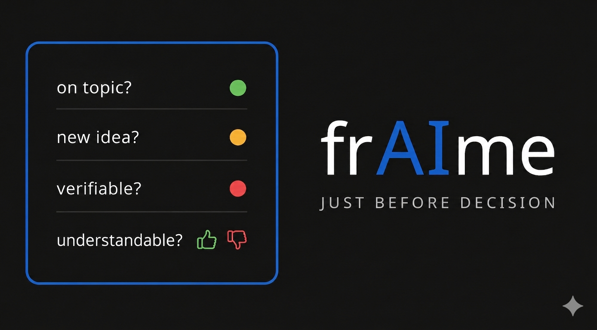

  

<h1 align="center">frAIme</h1>

🟢 Topic consistency • 🟡 Idea emergence • 🔴 Verifiability • 🔵 Understandability

<!-- Badges -->

  
  
  
  
  
  
  

  

  

  

<a href="https://doi.org/10.5281/zenodo.19793185">https://doi.org/10.5281/zenodo.19793185</a>

**frAIme macht Unsicherheit sichtbar – es schafft den Rahmen für verlässliche KI-Nutzung.**  
frAIme ist Governance by Design, nicht Ethik per Deklaration.

Für Klassenzimmer: vier Fragen, Ampel, fertig.  
Für Forschung: messbare Divergenz (drift), auditierbar.

**Version:** V1.0.0 (2026-04-26) – Stable Release

---
