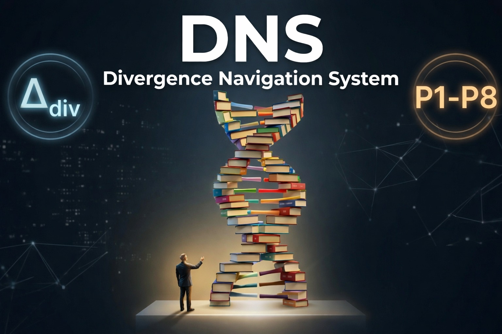

  

# DNS — Divergence Navigation System

**DNS does not reduce uncertainty — it makes it visible.**

**DNS is governance by design, not just ethics by declaration.**

> For classrooms and practice: four questions, traffic light, done.  
> For research: measurable divergence (Δdiv), auditable under EU AI Act.

**Version:** v2.1 (2026-04-15)  
**DOI:** https://doi.org/10.5281/zenodo.19597808  
**IPFS:** bafkreiblue2cs6e4xmpbpklkswimpzgnoumszgkvcm5csukdiqhqkf7wyy

---

## Start here — 2 minutes

### The Four Questions Method
Check every LLM answer:

1. **On topic?** 🟢 / 🔴
2. **New idea?** 🟢 / 🟡 / 🔴
3. **Verifiable?** (number, date, place, if-then) 🟢 / 🔴
4. **Understandable?** 👍 / 👎

**Good answer = 🟢 + 👍**

No account. No API. Works on paper.

---

## What DNS is technically

**Core metric**
$$\Delta_{div} = 0.5 \times (1 - \text{Jaccard}) + 0.5 \times (1 - \text{Cosine})$$

- 0.05 = convergence
- 0.62 = structured divergence
- 0.78 = contested

**Two layers**
- Frontend: Four Questions
- Backend: Safety Layer (JSON schema, hash anchors, SHAP)

---

## EU AI Act mapping

| Article | DNS Implementation |
| :--- | :--- |
| Art. 13 Transparency | Four Questions documented |
| Art. 14 Human oversight | Operator justifies synthesis |
| Art. 15 Robustness | Δdiv + falsification rules |

---

## Quick start
1. Read the architecture: [docs/team_architecture.md](docs/team_architecture.md)
2. Use the schema: `safety_layer_schema_v2.json`
3. Run the demo: `minimal_safety_layer.py`

---

## License
- Code: Apache-2.0
- Method: CC BY-NC-SA 4.0

DNS provides structure, not guarantees.
