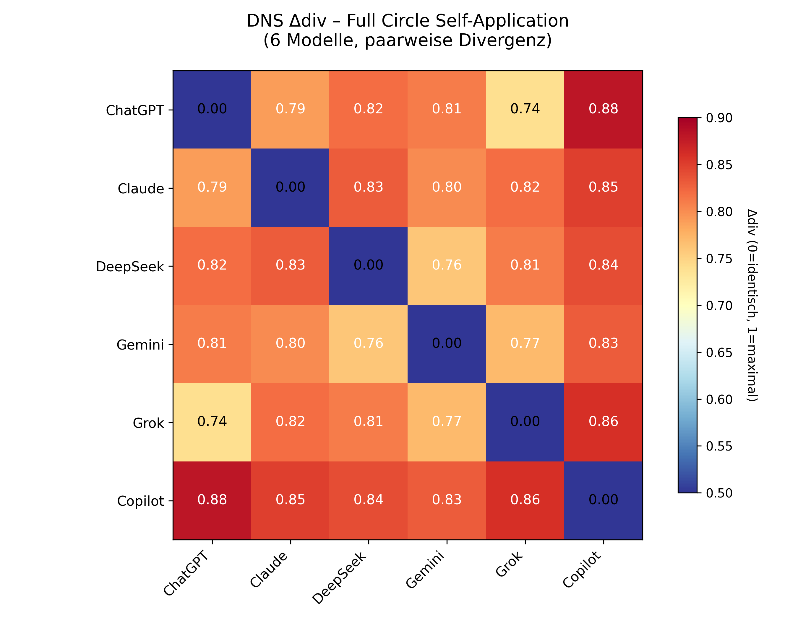

# Case Study: DNS Full Circle (Self-Application)

**Divergence Navigation System v2.1 — Self-Application to arXiv Whitepaper**

This case study applies DNS to itself. Six LLMs analyzed the DNS method from six different perspectives, creating a full-circle validation.

---

## Method

**DNS v2.1 Protocol:**
1. Hypothesis & Falsification
2. Model Selection (6 models)
3. Prompt Execution
4. Divergence Mapping
5. Weighted Human Synthesis
6. External Validation
7. Operator Reflection
8. Versioned Archiving

**Δdiv Formula:** $$\Delta_{div} = 0.5 \cdot (1 - \text{Jaccard}) + 0.5 \cdot (1 - \text{Cosine})$$

---

## Divergence Results

**Average Δdiv: 0.8142**  
**Interpretation: CONTESTED** (>0.78 threshold)

This is the highest divergence measured across all DNS case studies, confirming that DNS fragments into distinct perspectives when applied to itself.

### Pairwise Divergence Heatmap

*Six models, pairwise divergence. Values range from 0.74 (ChatGPT–Grok) to 0.88 (ChatGPT–Copilot).*

---

## Key Finding

DNS does not converge on itself — it fragments. This validates the core principle: divergence is signal, not noise.

| Case Study | Δdiv |
|------------|------|
| Cognitive Safety | 0.67 |
| Labour 2030 | 0.71 |
| **DNS Full Circle** | **0.81** |

---

## Files

- [`03_outputs/`](./03_outputs/) — 6 raw model responses
- [`04_delta_div.json`](./04_delta_div.json) — quantitative metrics
- [`04_divergence_map.md`](./04_divergence_map.md) — detailed analysis
- [`figures/dns_heatmap_full_circle.png`](./figures/dns_heatmap_full_circle.png) — visualization

---

## Comparison

| Case Study | Δdiv | Interpretation |
|------------|------|----------------|
| Cognitive Safety | 0.67 | Structured |
| Labour 2030 | 0.71 | Structured |
| **DNS Full Circle** | **0.81** | **Contested** |

---

*DNS v2.1 — Divergence Navigation System*  
*License: CC BY-NC 4.0*
